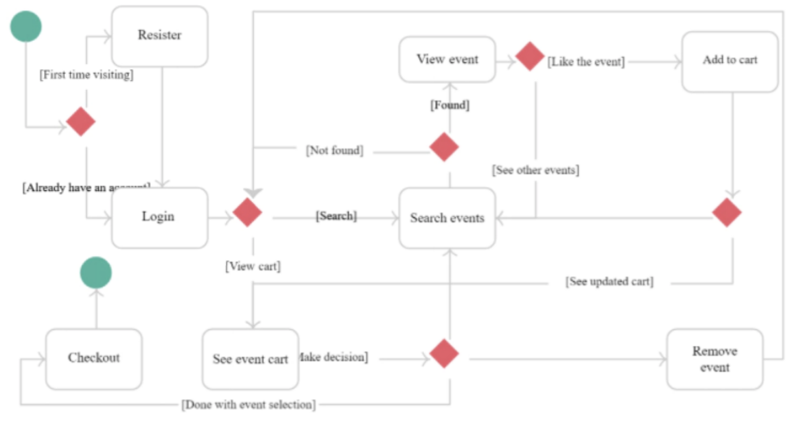
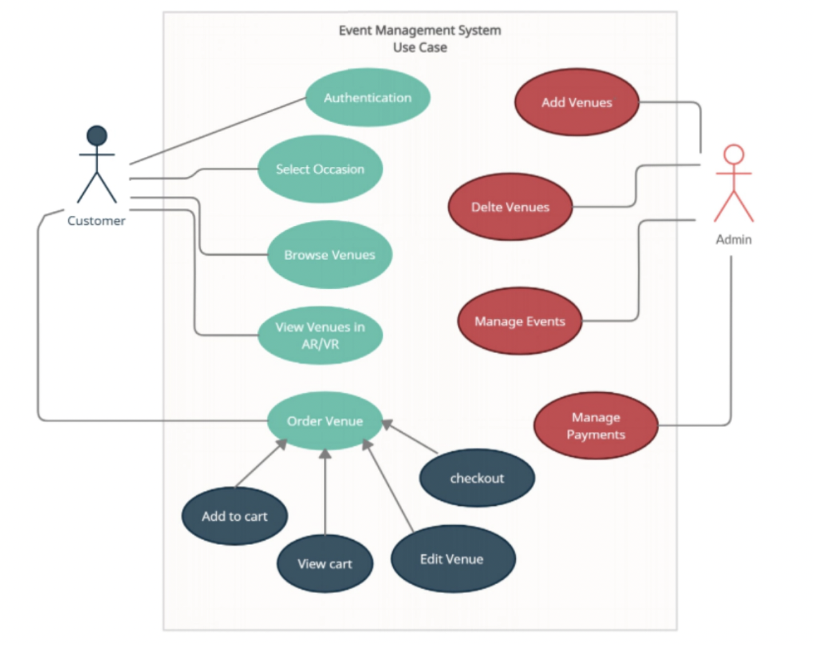
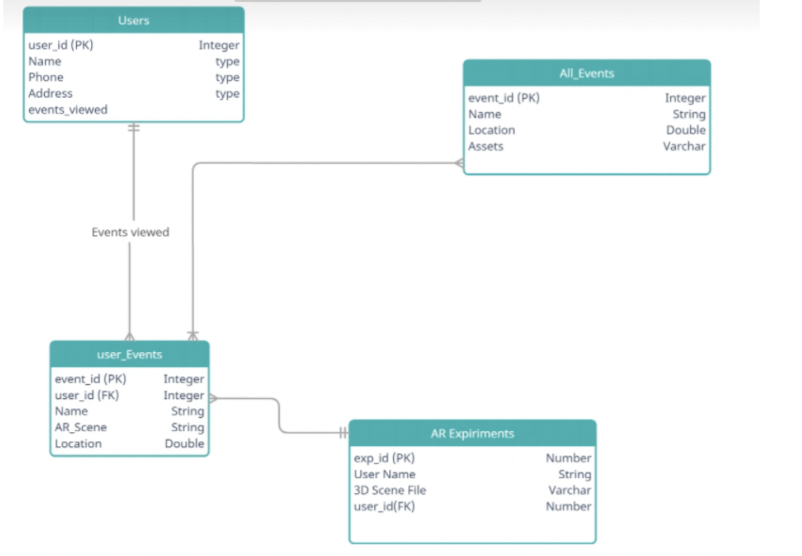
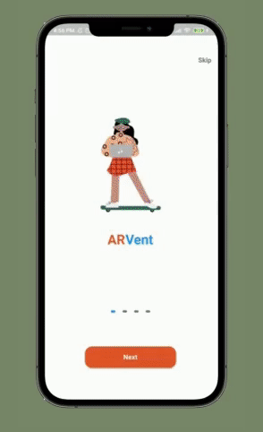

# AR Event Management with Razorpay Integration | Flutter

- User-friendly hassle-free website/Application based Event management App.
- Virtualise any event or event location before booking. 
- Firebase Integration for Authentication and Firestore to store user data.
- Flutter based
- AR/VR Video Integration. 
# Software Architecture

  
State Diagram 

  
Use case Diagram 

  

  

  
ER Diagram 

  
  

## Design

## Demo

  
